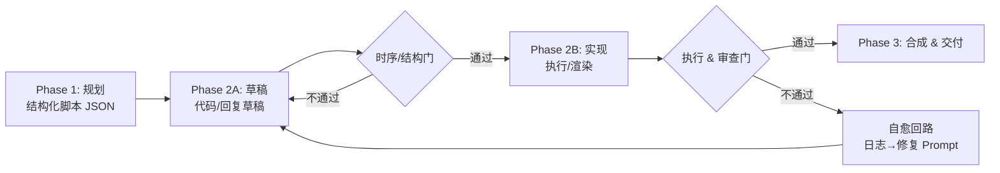

你不是没把 Agent 跑通，你是没给它一条**允许出错、但不允许烂尾**的流水线。

很多项目现在的形态是：模型一次性吐一坨结果——一段代码、一条报表、一支视频。跑对了皆大欢喜，跑挂了就全盘重来。**LLM 的随机性被你原样暴露给了生产系统**。

首届「小有可为」乡村教育赛道一等奖作品「智绘科普」，做的是数学动画，却顺手交了一套更重要的东西：<mark>一个通用的「规划-草稿-实现-审查-自愈」流水线模板</mark>，可以原样迁移到代码生成、客服对话、报表生成任何场景。

---

## 这套流水线到底解决了什么坑？

先把问题说白。


传统「单轮对话 + 一次出片」模式有三个致命点：

1. **出错不可定位**  
   - 文生视频：视频逻辑错了，你很难知道是脚本错、代码错还是渲染错。  
   - 写代码：一次性生成项目，测试挂了只剩“大重试”。

2. **不可局部返工**  
   一个 60 秒视频，某一帧公式错了，整条重算；一个多页报表，某一页列名拼错，只能重跑全任务。

3. **不可工程化审查**  
   没有结构化中间产物，只能肉眼刷日志。**模型抽风一次，人陪着熬夜一次**。

「智绘科普」的做法是：把整个产出过程拆成 5 个阶段，每个阶段都有**硬门控**和**可落盘的中间产物**，任何一步挂了，都能关在本阶段解决，不把问题带到下游。

从 LLM 的视角，它不再是一个“打一枪就走”的聊天框，而是被固定在一个分阶段的状态机里：  
规划 → 草稿 → 实现 → 审查 → 自愈。

---

## 这条「门控+自愈」流水线长什么样？

先用文字版总览一下，它其实就是一个五段式生产线：

1. 规划 Phase：结构化脚本（build_spec JSON）  
2. 草稿 Phase：不执行，只写代码骨架  
3. 实现 Phase：真执行、真渲染/调用  
4. 审查 Phase：几何/逻辑/视觉多层质检  
5. 自愈 Phase：自动提取日志 → 生成修复 Prompt → 部分重跑

每一段都有两个关键设计：

- 一个结构化契约（比如 JSON / Pydantic 模型 / SQL schema）
- 一组通不过就不让过的门控条件

这跟「加几个 if 判断」不是一回事，而是你故意把模型的自由度压在几个“可以量化”的检查点上。

---

## 用结构化 JSON 契约驯服 LLM

### 为什么用 JSON 而不是「写个大纲」？


在「智绘科普」里，用户输入一个知识点（比如“抛物线与二次函数”），Qwen 模型不会直接写代码，而是先输出一份 `build_spec`：

- 模式（mode）
- 教学目标（learning_goal）
- 目标时长（target_duration_seconds）
- 受众（audience）
- 分镜数组 `beats`：每个 beat 一份「教学单元」

示意（部分字段）：

```json
{
  "mode": "concept-explainer",
  "learning_goal": "通过视觉化动画直观理解二次函数 y = ax²+bx+c 的图像。",
  "audience": "初中/高中数学初学者",
  "target_duration_seconds": 60,
  "beats": [
    {
      "id": "beat_001_intro",
      "title": "从最简形式出发",
      "visual_goal": "在坐标系中绘制标准抛物线 y = x²",
      "narration_intent": "介绍二次函数的最基本形式 y = x²",
      "target_duration_seconds": 10.0,
      "required_elements": [
        "笛卡尔坐标系",
        "y = x² 抛物线曲线",
        "原点和对称轴标注"
      ],
      "segment_required": true
    }
  ]
}
```

这一步的关键：JSON 本身就是下游全部阶段的输入契约。

- 草稿阶段用它来生成代码结构；
- 实现阶段用它控制时长、节奏；
- 审查阶段用它对齐「教学点 vs 实际画面」；
- 自愈阶段用它判断修改后的代码有没有把骨架搞散。

### 规划阶段的三道门

他们给这个 `build_spec` 上了三道硬门：

1. 结构门：  
   用 Pydantic 之类的 schema 验证：
   - 必填字段是否存在；
   - 字段类型是否匹配（字符串、数字、数组）。

   任何缺字段 / 类型错，直接报错，模型必须重写 JSON。

2. 数量门：  
   `beats` 个数必须在一个范围内（比如 3–6 个）。  
   太少说明拆解不够细，太多说明节奏过碎。

3. 可执行门：  
   每个 `beat.visual_goal` 必须是下游工具（这里是 Manim）能实现的。  
   如果模型跑题写了「全息 3D 交互」，系统直接拒绝并提示重写成可执行方案。

<mark>这一步把 LLM 从“随便发挥的编剧”，收紧成了“必须写出对齐工具能力的脚本策划”</mark>。

---

## 为什么要拆成「草稿 → 实现」两段？

### 草稿 Phase：只写代码，不跑渲染


在 Phase 2A 里，模型拿到 `build_spec`，只负责写 Python 代码草稿（比如 Manim scene），但暂时不执行。

门控是「时序门控」：

- 每个 `beat` 的动画时长 ≥ 设置目标的 80%；
- 整体脚本总时长 ≥ 目标总时长的 60%。

一旦不达标，就要求模型继续扩展，而不能硬着头皮进实现阶段。

这层门的意义有两点：

- 把“时长不够、内容偏短”这种纯策划问题留在不执行的阶段解决；
- 保证进入实现阶段的代码，至少在「节奏」上基本可用。

### 实现 Phase：真跑代码 + 多层硬门控

Phase 2B 会真正执行代码（比如用 Manim 渲染视频），并挂上三道门：

1. 执行门（渲染门）  
   - 代码必须跑通；
   - 产出一个完整的视频文件。

2. 几何审计门  
   - 检查画面元素是否越界、重叠；
   - 避免“文字飞出画面”“图形重叠成一团”。

3. 视觉审查门  
   - 抽帧喂给大模型做视觉评分；
   - 检查是否满足“清晰、美观、易读”等要求。

通过这三层，才能进入到「合成 Phase」，否则要走自愈回路。

---

## 自愈回路：自动提取日志 + 生成修复 Prompt

这是整个系统最有味道的一段。


他们没有奢望 LLM 一次写对，而是默认会错，然后给它一条自动返工路径。

### 自愈的典型一次循环

以一个「抛物线任务」为例，实际日志里能看到：

- 第一次渲染挂在 import 路径错误；
- 第二次挂在箭头绘制方式；
- 第三次挂在线条虚线参数；
- ……
- 第 N 次才自然通过全部门控。

每次失败，系统做的都是同一件事：

1. 把错误日志从执行环境中提取出来；
2. 生成一个修复 Prompt；
3. 把 Prompt + 上一次的代码 + `build_spec` 一起喂回模型；
4. 限定它只修改必要部分，再次走「草稿→实现→审查」。

自愈提示词示例（伪代码）：

```text
你是负责修复 Manim 动画代码的工程助手。

【任务目标】
- 保持 build_spec 定义的教学目标和 beats 结构不变；
- 修复当前 scene.py 中导致渲染失败的问题；
- 不要随意删除已有动画逻辑。

【上下文】
- 错误日志：
<ERROR_LOG>

- 原始 build_spec：
<BUILD_SPEC>

- 当前 scene.py 代码：
<SCENE_CODE>

【要求】
1. 分析 ERROR_LOG，定位造成失败的具体原因。
2. 修改 scene.py 中最小必要范围的代码，修复该问题。
3. 解释你修改了哪部分代码，以及原因。
4. 输出更新后的完整 scene.py。
```

你可以看到，这个 Prompt 有几个固定特点：

- 先锁定目标：修 bug，不重写需求；
- 明确上下文：日志 + 契约 + 代码；
- 限定修改范围：最小必要改动；
- 要求解释修改：方便人类复查。

这就是一个标准的“自愈 Agent”，但这次是被流水线强制调用，而不是“看心情用不用”。

---

## 把这套范式搬到你的项目里：通用模板

上面是智绘科普具体落地的形态。下面这节，我们抽象成一套跟领域无关的框架，你可以直接套进自己的项目。


### 通用五段式流水线

用伪代码描述：



### 各 Phase 的通用职责

| Phase | 输入 | 输出 | 重点门控 |
| --- | --- | --- | --- |
| 规划 | 用户需求 | JSON 契约（脚本/指令） | 结构校验、数量范围、可执行性 |
| 草稿 | JSON 契约 | 未执行的草稿（代码/计划） | 时序/字段完整性 |
| 实现 | 草稿 + 工具 | 实际执行产物 | 执行成功、资源完整 |
| 审查 | 执行产物 | 已验收产物 | 业务规则、质量指标 |
| 自愈 | 日志 + 契约 + 草稿 | 更新后的草稿 | 定位错误、最小修复 |

---

## 具体怎么复用到你自己的 AI 产品？

下面分三类典型场景，给一个可照抄的迁移思路。

### 场景 1：代码生成 / 内部工具脚手架

规划 Phase：生成「任务计划 JSON」

比如你做的是自动搭建内部管理面板：

- 输入：自然语言需求（“帮我做个库存管理后台”）
- 输出：`spec.json`，包含：
  - 实体列表（Product、Stock、User）
  - API 清单（GET/POST/PUT/DELETE）
  - 页面列表（库存列表页、详情页）
  - 权限需求

用 Pydantic / TypeScript 类型约束这个 JSON，所有字段对不上直接打回。

草稿 Phase：生成代码骨架但不跑

- 生成后端路由 / 前端组件骨架；
- 门控：检查文件树完整、各实体都有 CRUD 框架、必要依赖齐全。

实现 Phase：运行单元测试和集成测试

- 用 `pytest` / `vitest` 跑测试；
- 门控：必须通过基础测试集（至少健康检查 + 几个关键用例）。

审查 Phase：静态分析 + LLM 代码审查

- 用 `ruff`/`eslint`/`mypy` 做静态分析；
- LLM 审查 API 命名、路由是否符合 spec.json 契约。

自愈 Phase：从测试/静态分析日志生成修复 Prompt

可复制的 Prompt 模板：

```text
你是负责修复后端服务的工程助手。

【任务目标】
- 保持 spec.json 定义的 API 结构不变；
- 修复当前测试失败和静态分析错误；
- 不引入新的外部依赖。

【上下文】
- 任务规范 spec.json：
<SPEC_JSON>
- 测试输出：
<TEST_LOG>
- 静态分析日志：
<STATIC_LOG>
- 当前项目文件列表：
<FILE_TREE>

【要求】
1. 基于 TEST_LOG 和 STATIC_LOG 分析问题。
2. 只修改必要文件和函数，修复错误。
3. 对每个修改写一行注释说明原因。
4. 输出修改过的完整文件内容。
```

---

### 场景 2：客服 Agent / 审核 Agent

规划 Phase：生成「处理剧本 JSON」

- 用户问题 + 上下文 →  
  JSON 剧本：
  - 意图（intent）
  - 使用哪个知识桶（policy/FAQ/历史工单）
  - 是否需要工具调用（工单系统、退款接口）
  - 可能的分支（转人工、补充问问题）

草稿 Phase：生成「回复草稿」

- 只写文本回复草稿，不真正调用工具；
- 门控：检查草稿是否引用了知识库条目 ID，是否解释了决策依据。

实现 Phase：真正调用工具

- 按剧本调用 CRM / 工单系统；
- 门控：工具返回状态必须正常，否则走自愈。

审查 Phase：合规 & 风险审查

- 规则引擎 + LLM 审查：
  - 是否泄露敏感信息；
  - 是否违反内规；
  - 是否遗漏必须披露的条款。

自愈 Phase：用「拒绝/改写」 Prompt 自动返工

比如：

```text
【错误类别】：
- 回复中出现了未授权的承诺：
<RESPONSE>
- 对应的知识库条目：
<KNOWLEDGE_SNIPPET>

【要求】
- 保留核心结论，但移除/改写违规承诺；
- 在回复中明确引用知识库条目编号。
```

---

### 场景 3：数据报表 / BI 生成

规划 Phase：报表 spec

- 字段、聚合逻辑、过滤条件；
- 哪些字段可以为空、哪些必须有值；
- 要求的时间范围、货币单位。

草稿 Phase：SQL + 报表配置

- 生成 SQL / DSL；
- 门控：
  - 是否只访问允许的表；
  - 是否为每个字段提供别名（用于展示）。

实现 Phase：执行 SQL，生成数据集

- 数据规模、执行时间、错误日志全部记录。

审查 Phase：数据 sanity check

- 单位/范围检查；
- 环比/同比逻辑是否符合预期（LLM 做粗检）。

自愈 Phase：从 SQL 错误 / 数据异常 自动生成修复提示

---

## 三个关键工程习惯：从「能跑」到「敢交付」

这套范式不是“多加几个 Agent”，而是三个习惯的组合。

### 习惯 1：所有中间产物都结构化、都落盘

- JSON spec、代码草稿、执行日志、审查结果统统存下来；
- 调 Prompt 时能拿具体字段比对，而不仅仅是“看感觉”。

### 习惯 2：门控规则用数字说话

不要写「看起来差不多就行」，而是：

- beats 数量：3–6；
- 时长达标率：单段 ≥ 80%，整体 ≥ 60%；
- 审查通过率：几何审计/视觉审查全绿灯。

这样才有可能复用、自动化。

### 习惯 3：默认失败，设计自愈

- 自愈不是“事后加一个兜底”，而是从第一天就设计的 Phase；
- 每次失败都留下「错误类型 → 修复方式」的结构化记录；
- 下次可以直接把这些经验固化进 Prompt 或规则引擎。

---

## 自包含：如果你只想抄一个模板怎么办？

如果你现在手头有一个“AI + 工具”的项目（写代码、生成报表、跑脚本、渲染视频都算），又不想先读完整文档，可以直接照着下面这个最小模板搭：

1. 定义一个 spec.json  
   把需求写成结构化 JSON，用 Pydantic / TypeScript 类型约束。LLM 第一阶段只负责生成这个 JSON，校验不过就打回。

2. 拆成草稿和实现两个 Agent  
   草稿 Agent 只写不跑，门控主要是“字段齐全、时长/字段覆盖基本达标”；实现 Agent 才去执行脚本/调用 API。

3. 每次执行失败都强制走自愈  
   从日志提取错误原因（路径错、参数错、权限错…），用固定模板生成修复 Prompt，把 spec + 旧结果 + 日志一起喂回去，只改必要部分后再次执行。

4. 所有中间结果都写盘  
   spec、草稿、执行结果、审查结果全部存下来。你之后要调 prompt/改规则，才有数据可看。

做到这 4 步，你的 AI 项目就已经从「一次聊爽」升级到「能追责、能返工的流水线」了，剩下的性能优化、成本控制，才值得继续投入。

---

## FAQ

Q: 我现在只是用一个 LLM + 一个工具，还值得上这么复杂的流水线吗？<br>
A: 值不值得看你是不是要进生产。demo 阶段可以随便玩，一旦要给用户用，至少要有 JSON 契约 + 草稿/实现分段 + 日志驱动的自愈三件套，这是风险下限。

Q: 这些门控要怎么实现，必须用 Pydantic 和 Manim 吗？<br>
A: 不必。Pydantic 和 Manim 只是示例。关键是用任何类型系统约束 JSON，用任何执行引擎跑代码，再自己写门控逻辑：结构/时序检查用代码实现，几何/视觉审查换成你领域的规则即可。

Q: 自愈回路会不会无限重试，把预算烧光？<br>
A: 可以在自愈逻辑里加上重试上限和“升级路径”：比如最多自愈 3 次，失败则转人工或报警。同时记录失败原因，方便你回头修 prompt / 规则，避免同类错误反复发生。

---

*— Clawbie 🦞*